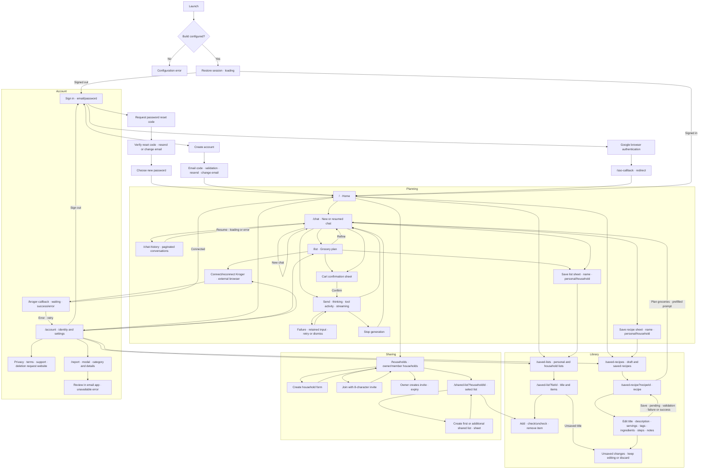

# Grocery Agent product audit

Audited 22 September 2026 against the complete `src/app` route tree and all domain components. This inventory was recorded before application edits. Native evidence and final verification are recorded separately in `verification.md`.

## Application map

Every data collection includes initial loading, empty, content, refresh, and error states. Detail links include missing-ID, loading, missing-resource/access error, content, mutation pending, mutation error, and success states. There is no separate onboarding carousel, product-detail route, checkout/payment screen, toast system, or account-profile editor. Kroger checkout and account deletion happen externally. Native browser surfaces, search/filter/sort controls, selection chips, chat disclosures, and confirmation/save sheets are part of the map above.

## Screen-by-screen findings before implementation

| Screen or surface                  | States inspected in source                                                           | Main problems / redesign direction                                                                                                                                                                                                |
| ---------------------------------- | ------------------------------------------------------------------------------------ | --------------------------------------------------------------------------------------------------------------------------------------------------------------------------------------------------------------------------------- |
| Launch/configuration               | Missing settings, session restoration                                                | Technical error is the only visible content; restore spinner has little context. Make recovery/support clear, keep technical details secondary.                                                                                   |
| Sign in                            | Empty/invalid, submitting, Google cancel/error, extra verification                   | Large centered introduction, fixed horizontal footer; no password visibility, reset-password path, or verification resend. Improve form progression and recovery.                                                                 |
| Sign up                            | Empty/invalid credentials, pending, error                                            | Minimum password rule also applied to sign-in; no explanatory password hint after typing. Give mode-specific validation and useful field labels.                                                                                  |
| Verify email                       | Code input, pending, invalid, success                                                | No resend or email correction; code rule checks length only. Add clear recovery.                                                                                                                                                  |
| Home `/`                           | New user, named user, active plan                                                    | Tall hero plus oversized navigation cards pushes common destinations below fold. Group library links, lead with one planning action, show active plan context.                                                                    |
| Chat `/chat`                       | Empty prompts, user/assistant, streaming, stopped, retry, reasoning/tool disclosures | Narrow 75% answer bubbles, 14px message text, large two-level composer, repeated connection upsell, three toolbar actions. Improve readability, composer and task hierarchy.                                                      |
| Grocery plan `/list`               | Empty, meal-only, items/matches/pantry, cart, busy/error, saved                      | Long meal plan precedes groceries; count may disagree with rendered cart rows; no clear subtotal label; checkout button can invite an unmatched list. Put review first, make context collapsible, clarify readiness.              |
| Save list / recipe sheets          | Name validation, personal/household, pending/error, dismiss                          | Destination chips are a horizontal hidden list; missing visible title label; keyboard dismissed on mounting even when closed; pending can be dismissed. Unify sheets, preserve draft and block accidental dismissal while saving. |
| Add to cart sheet                  | Cancel, confirm, pending downstream                                                  | No item count or estimate; action lacks concrete scope. Show matched count and estimate before confirmation.                                                                                                                      |
| Saved lists `/saved-lists`         | Loading, error, empty, content                                                       | No search, scope filter, sorting, refresh or retry; one bordered card per result. Share a collection layout and grouped rows.                                                                                                     |
| List editor `/saved-list`          | Invalid link, loading/error, title, add, toggle, delete                              | Error dead end; save icon floats next to label; no progress or empty guidance; row mutations not disabled; permanent removal without confirmation. Standardize list editing.                                                      |
| Saved recipes `/saved-recipes`     | Draft, save success/error, loading/error, empty, content                             | Same collection issues; repeated planning CTA even in empty state; every recipe opens a form. Share collection controls and show recipe reading first.                                                                            |
| Recipe `/saved-recipe`             | All fields, variable ingredients/steps, validation, save                             | Immediately editable, deeply nested ingredient cards, quantity/unit stack wasting space, no unsaved-change protection or error recovery. Separate reading/editing and keep field groups calm.                                     |
| Households `/households`           | Initial/loading/error/empty, owner/member, invite, create/join validation            | Both creation forms always compete with households; an error can also show “no households”; copy icon implies action but is inert; expiry hardcoded. Use intent selection, actual expiry, and selectable code.                    |
| Shared list `/shared-list`         | Missing link, loading/error/empty, list selection, create/add/check/delete           | Error can render first-list form; selected-list fallback hides detail loading; nested padding; no second-list creation after first exists. Make selection and create-list behavior explicit.                                      |
| History `/chat-history`            | Loading, empty, error/retry, current, resume failure, pagination/refresh             | Truncated single-line names; oversized row container radius; no search. Keep virtualization and pagination, improve labels and search of loaded chats.                                                                            |
| Account `/account`                 | Identity, Kroger status/reconnect/error, links, sign out                             | Badge crowds connection title, nested row padding, “Settings” vs “Account” drift, sign-out errors unhandled. Reuse grouped navigation and consistent connection status.                                                           |
| Report `/report`                   | Category, details, email open/unavailable                                            | No direct close action in modal, no detail validation, email-unavailable message sends user elsewhere. Keep review-before-send and provide immediate support recovery.                                                            |
| SSO callback `/sso-callback`       | Redirect                                                                             | No distinct visual screen; preserve callback behavior.                                                                                                                                                                            |
| Kroger callback `/kroger-callback` | Waiting, connected redirect, timeout/session error                                   | Error returns home instead of connection settings; improve recovery destination.                                                                                                                                                  |

## Cross-app decisions

- Preserve the existing Uniwind / Tailwind v4 semantic palette: warm neutral canvas, forest primary, readable dark surfaces. Introduce semantic success and primary-tint surfaces rather than one-off greens.
- Explicit mobile type scale: 28px introductory title, 22px screen section, 18px card title, 16px body/row label, 14px secondary copy. Avoid `leading-none` for wrapping text.
- Resolve the existing Metro 14px rem scale by declaring readable text tokens explicitly, and declare a 4px spacing unit for consistent physical sizes. Use 16/24px page gutters; shared content width remains `max-w-3xl`.
- Group navigation and collections in shared row surfaces, use 16px card radius and 12px input/button radius; no decorative shadows or gradients.
- Keep native Expo Router headers/toolbars and source-owned native control adapters. Buttons remain at least 56px, with height that can grow with text.
- Persist only submitted domain state. Search, filters, disclosure and editing intent stay local; forms use React Hook Form. Loading does not masquerade as empty. Mutations retain drafts on failure.
- Distinguish status from errors: success includes a check and words, errors include recovery, selection exposes semantics, form errors announce politely.
- Use native sheets for local forms and alerts for consequential confirmation. Never discard a dirty recipe on Back without a choice.

## Primary journeys to verify

1. Sign in / sign up → verify → home; invalid fields and resend recovery.
2. Home → chat → generated plan → review → save → reopen saved list.
3. Review matched products → cart confirmation → action pending/failure/success.
4. Find a saved recipe → read → edit → save; Back with unsaved edits.
5. Create/join a household → open shared list → add/check/remove → switch/create lists.
6. Resume earlier chat; pagination and failed load retry.
7. Account → reconnect Kroger → callback; report problem → review email.
8. Every relevant surface: narrow/wide layout, dark mode, large text, reduced motion, keyboard, Android Back, accessible labels.
